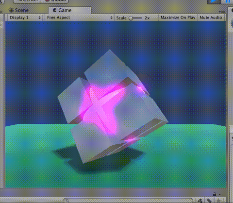

test13_bloomのメモ
====

参考
----
Unity - マニュアル: ブルーム
  * http://docs.unity3d.com/ja/current/Manual/script-Bloom.html

Bloomで光の演出 - テラシュールブログ
  * http://tsubakit1.hateblo.jp/entry/2014/09/09/022045

【Unity】Unity 5 で「光モノ系」を表現するあれこれ - テラシュールブログ
  * http://tsubakit1.hateblo.jp/entry/2015/06/24/055130

Standard AssetsにあるBloomを使うメモ
----
事前の準備

  * Edit->Project Settins->QualityからAnti Aliasingをdisableに設定
    * HDRはAntialiasingと同時に使えないみたい。
  * CameraのプロパティにあるHDRにチェックを入れておく
    * 明るさ0.0～1.0以上の範囲を取り扱うときに必要な設定。
  * Asset->Import Package->Effectでとりあえず全部インポート
  * Standard Assets->Effects->ImageEffects->ScriptsにBloomのスクリプトがあるので、これをカメラにattachする。

Bloomの設定について

  * ThresholdはBloomする明るさの閾値
    * 初期値0.5
    * 明るさがこの値を超えるとBloomの表現が有効になる
  * IntensityはBloomするときの明るさの度合

Materialの設定について

  * Standard SharderのEmission(自己発光)を使って調整すると楽っぽい。

BloomのThreshold初期値は0.5なので、画面中にあるものがわりと
なんでもBloomしてしまう。

そこで、BloomのThresholdに1以上の値を設定しておき、
Bloomが必要な部分のEmissionを高くしておくことで、
必要な部分のみ光らせるのがコツっぽい。

