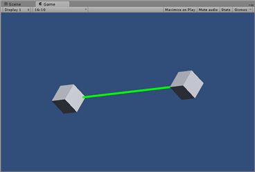

test27_line
====
LineRendererを使って3Dの線を描画するサンプル。

LineRendererの使い方メモ
----
* (1) GameObjectにLineRenererコンポーネントを付ける
  * メニューの"Component"→"Effects"→"Line Renderer"
* (2) LineRendererコンポーネントのパラメータを適切に設定
  * 点の数、点の位置、太さ、マテリアルなど
  * マテリアルは光源の影響を受けない"Sprite/Default"に色を付けておけばソリッドな線
* (3) 線の始点・終点の位置を動的に変えたい場合は、スクリプトから制御する
  * LineRenderer.SetPosition(インデックス, 位置)で変更可能

動的にLineRendererの始点・終点の位置を変えるスクリプト例
----
    using UnityEngine;
    
    public class Line : MonoBehaviour {
    
        [SerializeField]
        GameObject fromGameObject;
    
        [SerializeField]
        GameObject toGameObject;
    
        LineRenderer lineRenderer;
    
    	void Start () {
            lineRenderer = gameObject.GetComponent<LineRenderer>();
    	}
    	
    	void Update () {
            if (lineRenderer == null) return;
            if (fromGameObject == null) return;
            if (toGameObject == null) return;
    
            lineRenderer.SetPosition(0, fromGameObject.transform.position);
            lineRenderer.SetPosition(1, toGameObject.transform.position);
        }
    }
