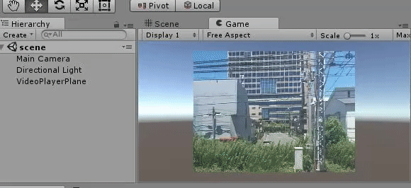

test31_videoplayer
====

Unity 5.6から導入されたVideoPlayerクラスの使い方サンプル。

参考
  - https://docs.unity3d.com/560/Documentation/ScriptReference/Video.VideoPlayer.html
  - https://docs.google.com/document/d/1gZa5z_jEEETDk8E_hbYXXjNhetRlM9eu8eTpbfMkRYY/edit

    using UnityEngine;
    using UnityEngine.Video;
    
    public class VideoControllScript : MonoBehaviour {
    
        VideoPlayer video_player;
        VideoClip video_clip_00;
        VideoClip video_clip_01;
        int play_movie_id;
    
        void Start () {
            video_player = gameObject.GetComponent<UnityEngine.Video.VideoPlayer>();
            video_player.loopPointReached += EndReached;
    
            video_clip_00 = Resources.Load<VideoClip>("video_clip_00");
            video_clip_01 = Resources.Load<VideoClip>("video_clip_01");
    
            play_movie_id = 0;
            video_player.clip = video_clip_00;
            video_player.frame = 0;
            video_player.Play();
        }
    
        void Update () {
    	}
    
        void EndReached(UnityEngine.Video.VideoPlayer video_player)
        {
            Debug.Log("VideoControllScript.EndReached()");
            if (play_movie_id == 0)
            {
                video_player.clip = video_clip_01;
                play_movie_id = 1;
                video_player.frame = 0;
                video_player.Play();
            }
            else
            {
                video_player.clip = video_clip_00;
                play_movie_id = 0;
                video_player.frame = 0;
                video_player.Play();
            }
        }
    }

メモ

  - ループ再生はスムーズに行われるのに、VideoClip.loopPointReachedに設定した関数が、微妙にワンテンポ遅れて呼び出されるのはなぜ…？
