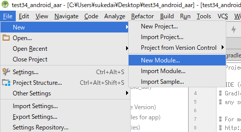
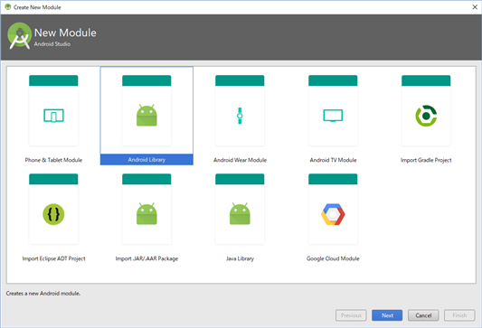
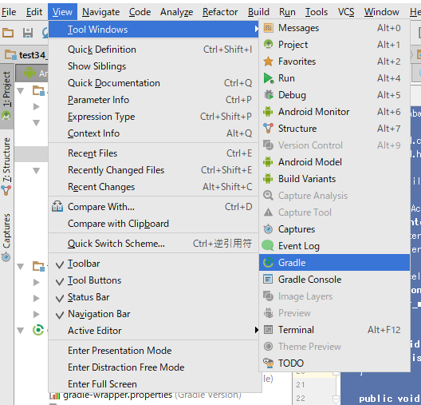
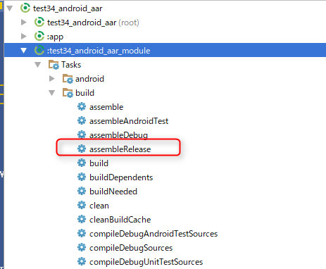

test34_android_aar
====

UnityでAndroidアプリを作成する際に、JavaでAAR(Android Archive)ファイルを作成して、ネイティブ機能をUnityに提供する方法のメモ。

* 

AARはjarと異なり、実行に必要なリソースやAndroidManifest.xmlなども含めることができる。
AARファイルを使用すると、UnityでAndroidアプリをビルドする際に、AARファイル内のAndroidManifest.xmlの内容を適当にマージしてくれるのでとても便利。(クラス名・パッケージ名のコンフリクトには要注意)

Android Studio側でAARファイルを作る手順は次の通り。

まずはじめに、Android Studioでモジュールを作成する。
* 
* 

モジュール内に適当なクラスを作成。もしパーミッションが必要な場合は、モジュール側のAndroidManifest.xmlにuses-permissionを追加する。作成するモジュール内のクラスはテストやActivity等を作成して、Android Studio上で十分動作確認しておくこと。

    code:Accelerometer.java
    
      package net.sabamiso.android.test34_android_aar_module;
      
      import android.content.Context;
      import android.hardware.*;
      
      import java.util.List;
      
      public class Accelerometer implements SensorEventListener {
          Context context;
          SensorManager sensor_manager;
          AccelerometerEventListener listener;
      
          public Accelerometer(Context context) {
              this.context = context;
              sensor_manager = (SensorManager)context.getSystemService(Context.SENSOR_SERVICE);
          }
      
          public void setAccelerometerEventListener(AccelerometerEventListener listener) {
              this.listener = listener;
          }
      
          public void start() {
              List<Sensor> sensors = sensor_manager.getSensorList(Sensor.TYPE_ACCELEROMETER);
              if (sensors.size() > 0) {
                  Sensor sensor = sensors.get(0);
                  sensor_manager.registerListener(this, sensor, SensorManager.SENSOR_DELAY_GAME);
              }
          }
      
          public void stop() {
              sensor_manager.unregisterListener(this);
          }
      
          @Override
          public void onSensorChanged(SensorEvent event) {
              if(event.sensor.getType() == Sensor.TYPE_ACCELEROMETER && listener != null) {
                  listener.onAccelerometer(event.values[0], event.values[1], event.values[2]);
              }
          }
      
          @Override
          public void onAccuracyChanged(Sensor sensor, int accuracy) {
          }
      }

作成したモジュールを次の手順でAARファイルに出力する
* メニューからView→Tool Windows→Gradleを選択。Gradleウインドウが開く。
  * 

* Gradleウインドウに表示されているタスク一覧から"モジュール名"→Tasks→build→"assembleRelease"を実行する
  * 

ビルドに成功すると、プロジェクトのディレクトリ→モジュールのディレクトリ→build→outputs→aar→「モジュール名」-release.aarファイルが作成される。
このAARファイルをUnity側のPlugin→Androidディレクトリにコピーする。

次に、Unity側からAARを使用する手順。

Unity(C#)→Java(AAR)の呼び出しは、Unityに用意されているAndroidJavaObject、AndroidJavaClassクラスを使用する

    code:example.cs
    
      void CallStart()
      {
          AndroidJNI.AttachCurrentThread();
          AndroidJNI.PushLocalFrame(0);
    
          accelerometer.Call("start");
    
          AndroidJNI.PopLocalFrame(System.IntPtr.Zero);
      }

Java(AAR)→Unity(C#)の呼び出し方法は次の2つ
* (1) com.unity3d.player.UnityPlayer.UnitySendMessage()メソッドを使用する方法
  * UnitySendMessage("GameObject名", "メソッド名", 引数)でUnity側のGameObjectにあるメソッド名を呼び出すことができる。
* (2) AndroidJavaProxyを使用する方法
  * AndroidJavaProxyクラスを使用すると、Unity(C#)側でJavaのインタフェースを実装することができる。

ここでは(2)のAndroidJavaProxyを使用する方法を説明。

次の要領でJavaのインタフェースを実装したクラスをUnity(C#)側で作成する。インタフェースで定義されているメソッド名はUnity(C#)側でも同じ名前を使用すること。
(Java側の命名は小文字始まりのcamelcaseなのでそれに合わせている)
  	
    code:AccelerometerEventListener.cs
    
      public class AccelerometerEventListener : AndroidJavaProxy
      {
          GameObject game_object;
      
          public AccelerometerEventListener(GameObject game_object) 
            : base("net.sabamiso.android.test34_android_aar_module.AccelerometerEventListener")
          {
              this.game_object = game_object;
          }
      
          public void onAccelerometer(double x, double y, double z)
          {
          	// ここがJava側から呼び出される
          }
      }

AndroidJavaProxyクラスを継承して作成したクラスを、次の要領でイベントリスナ登録し、Java(AAR)側からAccelerometerEventListener.onAccelerometer()を呼び出してもらう。

    code:script.cs
      
      AccelerometerEventListener event_listener = new AccelerometerEventListener(gameObject);
      accelerometer.Call("setAccelerometerEventListener", new object[] { event_listener });

