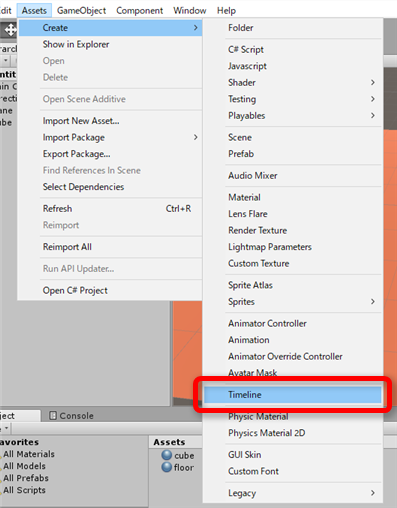
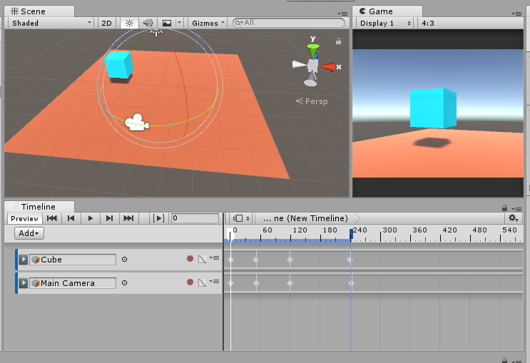

test36_timeline
====

 

メモ
----

* まずアセットを作成
  * Assets→Create→Timeline

* シーンにTimelineを追加する

* シーン内にあるタイムラインを選択すると、Timeline Editorが開く

* あとはTimelineに制御対象物を追加したり、キーフレームを付けたりとか…

カメラ制御は[Cinemachine](http://www.cinemachineimagery.com/)との組み合わせがよさげ。

