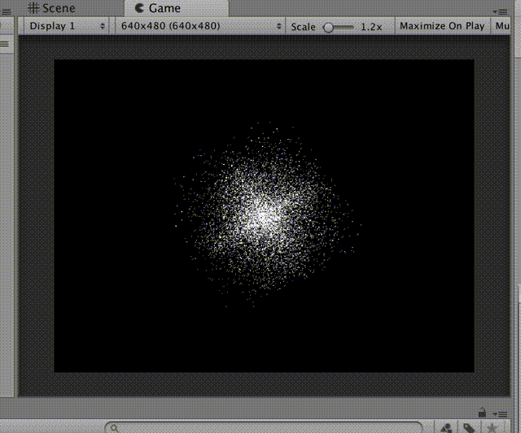

test38_points
====

Unityで点群を描画するサンプル。

Mesh.SetIndices()でMeshTopology.Pointsを指定する。

    void Start () 
    {
        Mesh mesh = new Mesh();

        float w = 1.0f;

        List<Vector3> v = new List<Vector3>();
        for (int i = 0; i < 10000; ++i) {
            float x = Random.Range(-w, w) * Random.Range(-w, w);
            float y = Random.Range(-w, w) * Random.Range(-w, w);
            float z = Random.Range(-w, w) * Random.Range(-w, w);
            v.Add(new Vector3(x, y, z));
        }
        mesh.SetVertices(v);

        int[] idxs = new int[mesh.vertices.Length];
        for (int i = 0; i < idxs.Length; i++)
        {
            idxs[i] = i;
        }
        mesh.SetIndices(idxs, MeshTopology.Points, 0);

        MeshFilter mesh_filter = gameObject.GetComponent<MeshFilter>();
        mesh_filter.sharedMesh = mesh;

        MeshRenderer mesh_renderer = gameObject.GetComponent<MeshRenderer>();
        mesh_renderer.material = this.material;
    }

