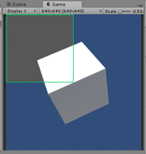

test45_opencv
====
How to use [OpenCV for Unity](https://assetstore.unity.com/packages/tools/integration/opencv-for-unity-21088)

sample
----

    void OnRenderImage(RenderTexture src, RenderTexture dst)
    {
        checkImages(src);

        // RenderTexture -> Texture2D
        RenderTexture.active = src;
        texture.ReadPixels(new UnityEngine.Rect(0, 0, src.width, src.height), 0, 0);
        texture.Apply();

        // Texture2D to cv::Mat
        Utils.texture2DToMat(texture, src_img);

        // image processing
        Mat roi_img = new Mat(src_img, new OpenCVForUnity.Rect(0, 0, src.width / 2, src.height / 2));

        Mat mono_img = new Mat(roi_img.rows(), roi_img.cols(), CvType.CV_8UC1);
        Imgproc.cvtColor(roi_img, mono_img, Imgproc.COLOR_BGR2GRAY);
        Imgproc.cvtColor(mono_img, roi_img, Imgproc.COLOR_GRAY2BGR);

        Imgproc.rectangle(roi_img, new Point(0, 0), new Point(roi_img.cols(), roi_img.rows()), new Scalar(0, 200, 100), 5);

        // cv::Mat -> Texture2D
        Utils.matToTexture2D(src_img, texture);

        // Texture2D -> RenderTexture
        Graphics.Blit(texture, dst);
    }
}
