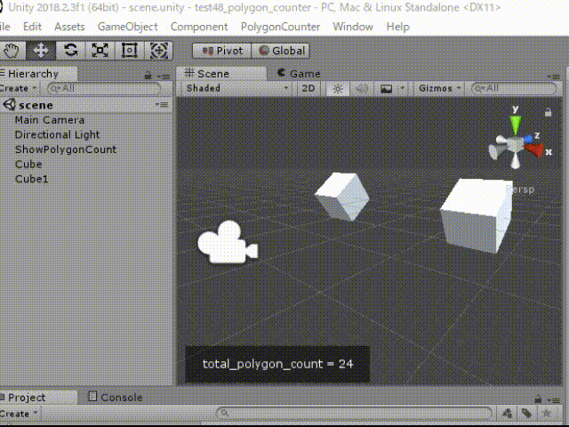

# test48_polygon_counter

    static long GetTotalPolygonCount()
    {
        long total_polygon_count = 0;

        // UnityEngine.Object.FindObjectsOfType(）はシーン中に存在するアクティブなgameObjectが列挙対象
        // 非アクティブなオブジェクトや、リソース内も列挙する場合は、UnityEngine.Resources.FindObjectsOfTypeAll()を使用すること
        foreach (MeshFilter filter in UnityEngine.Object.FindObjectsOfType(typeof(MeshFilter)))
        {
            int count = filter.sharedMesh.triangles.Length / 3;
            total_polygon_count += count;
        }
        return total_polygon_count;
    }