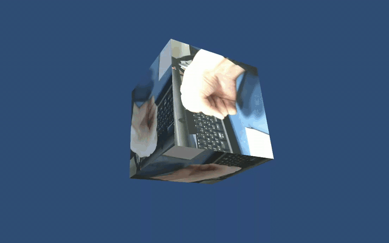

# test50_native_camera_capture

Androidのリアカメラを使ってキャプチャした画像をTexture2Dとして表示するサンプル。
  - 

## 注意点
このサンプルをビルドする場合は、Player Settings → Other Settings → Rendering → Multithreaded Rendering をOFFに設定すること。

  - 

ここをONに設定しているとスクリプトを実行するスレッドと、描画を行うスレッドが別になる。
スクリプトを実行するスレッド上にはOpenGL ESのコンテキストがないため、スクリプトのスレッド上でGLES20.glGenTexture()を実行してもテクスチャが生成されない…

Multithreaded Renderingを有効にした状態でレンダリングスレッド上からテクスチャを更新したい場合は、Low-Level Native Plugin Interfaceを使用する必要があるみたい。

  - [Unity - Manual: Low-level Native Plugin Interface](https://docs.unity3d.com/Manual/NativePluginInterface.html)

ただし、このドキュメントにリンクがあるサンプルコードにはAndroid用のサンプルが含まれていないため、具体的にどうやって実装すればいいのかはいまのところ不明…

  [Unity-Technologies / GraphicsDemos — Bitbucket](https://bitbucket.org/Unity-Technologies/graphicsdemos)

