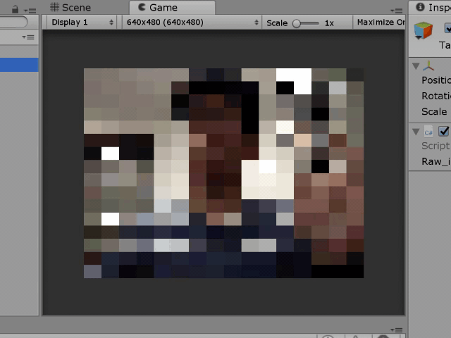

test51_resized_texture
====

    void Update () {
        if (web_cam_texture == null) return;

        web_cam_texture.filterMode = FilterMode.Point;

        // サイズの異なるRenderTextureを用意して、そこへTexture2DをBlit()することでリサイズ
        RenderTexture tmp_rt = RenderTexture.GetTemporary(resized_texture.width, resized_texture.height);
        Graphics.Blit(web_cam_texture, tmp_rt);

        // RenderTextureの内容をTexture2Dへ反映する
        var current_rt = RenderTexture.active;
        RenderTexture.active = tmp_rt;

        resized_texture.ReadPixels(new Rect(0, 0, resized_texture.width, resized_texture.height), 0, 0);
        resized_texture.Apply(); // Textureの内容を更新したときは必ずApply()を実行すること

        RenderTexture.ReleaseTemporary(tmp_rt);
        RenderTexture.active = current_rt;
    }
