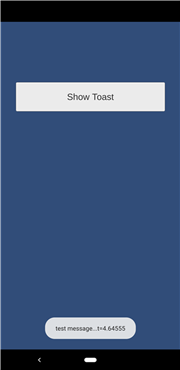

# test55_android_toast

## code

    AndroidJavaClass unity_player_class = new AndroidJavaClass("com.unity3d.player.UnityPlayer");
    AndroidJavaObject activity = unity_player_class.GetStatic<AndroidJavaObject>("currentActivity");
    AndroidJavaClass toast_class = new AndroidJavaClass("android.widget.Toast");
    activity.Call("runOnUiThread", new AndroidJavaRunnable(() =>
    {
        AndroidJavaObject toast = toast_class.CallStatic<AndroidJavaObject>(
            "makeText",
            activity,
            msg,
            toast_class.GetStatic<int>("LENGTH_LONG"));
        toast.Call("show");
    }));