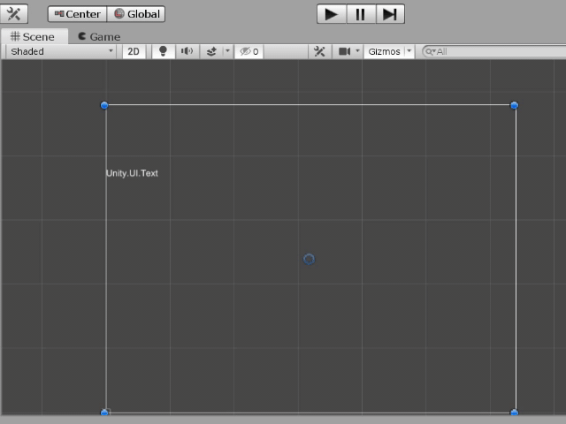

# test59_filedialog

    using System;
    using System.IO;
    using UnityEngine;
    using UnityEngine.Events;
    using UnityEditor;
    
    [System.Serializable]
    public class FileOpenEvent : UnityEvent<string>
    {
    }
    
    public class SceneViewFileDialog : MonoBehaviour
    {
        public string dialog_extention = "*";
        public FileOpenEvent file_open_event;
    
        string selected_file_path;
    
        Rect windowRect;
    
        void OnSceneGUI(SceneView sceneView)
        {
            Handles.BeginGUI();
    
            windowRect = GUILayout.Window(1, new Rect(5, 20, 300, 100), OnWindowGUI, "file dialog");
    
            float w = UnityEditor.SceneView.lastActiveSceneView.position.width;
            float h = UnityEditor.SceneView.lastActiveSceneView.position.height;
    
            Handles.EndGUI();
        }
    
        void OnWindowGUI(int id)
        {
            if (GUILayout.Button("Select File"))
            {
                string path = EditorUtility.OpenFilePanel("select file...", "", dialog_extention);
                FileInfo fi = new FileInfo(path);
                if (fi.Exists == true)
                {
                    selected_file_path = path;
                    file_open_event.Invoke(path);
                }
            }
    
            GUILayout.Label("selected file path");
            GUILayout.TextArea(selected_file_path);
        }
    
        void Awake()
        {
            SceneView.duringSceneGui += OnSceneGUI;
        }
    
        void OnDestroy()
        {
            SceneView.duringSceneGui -= OnSceneGUI;
        }
    
    }
