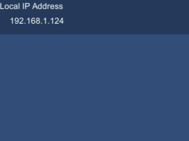

# test60_getipaddress

    using System.Net;
    using System.Linq;
    using UnityEngine;
    using UnityEngine.UI;

    public class TextIndicatorForLocalIpAddress : MonoBehaviour
    {
        private Text text;

        void Start()
        {
            text = GetComponent<Text>();
        }

        void Update()
        {
            text.text = GetLocalIpAddresses();
        }

        string GetLocalIpAddresses()
        {
            string local_hostname = Dns.GetHostName();
            IPAddress[] local_addrs = Dns.GetHostAddresses(local_hostname);
            var res = local_addrs
                            .Where(addr => addr.ToString().IndexOf("169.254") != 0) // ignore APIPA
                            .Where(addr => addr.ToString().IndexOf(":") < 0); // ignore IPv6 address

            return string.Join(",", res);
        }
    }
