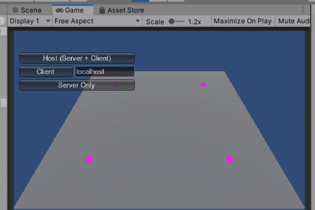

# test63_mirror_test

How to use [GitHub - vis2k/Mirror: A community replacement for Unity's abandoned UNET Networking System.](https://github.com/vis2k/Mirror)



## 使い方メモ
  - Server/Client/Player/LocalPlayerの意味をしっかり理解すること
  - どこのプロセス上で動く処理なのかを意識する
  - Authority : 操作可能な権利
  - 共有するGameObjectには、NetworkIdentityを付加する
  - SpawnするPrefabは、あらかじめNetworkManagerヘ設定する
      - PlayerはClient接続時にNetworkManagerによって自動的にシーンにSpawnされる
      - その他NetworkIdentityが付加されているGameObjectもClient接続時に自動的に復元される
  - 端末間で位置を合わせておきたいGameObjectにはNetworkTransformをAddComponentしておく
  - RigidBodyはServerのみで動かすこと。NetworkTransformが付加している状態でクライアント側でもRigidBodyを動かしてしまうと、状態があわなくなる…

## クラスのメモ
NetworkManager

  - サーバ・クライアントどちらにもなるクラス
  - デフォルトの通信ライブラリはTelepathy
  - 必ずPlayerになるPrefabを設定する必要がある
  - 途中でSpawnするものは、Registrated Spawnable Prefabsに登録しておく
  - OnServerAddPlayer() : Playerが増えたとき
  - OnServerDisconnect() : 接続が切れたとき

NetworkManagerHUD

  - NetworkManagerの制御用UI
  - server, client, server+client, …などの起動モードが選べる

NetworkStartPosition

  - Client接続時にPlayerをSpawnする場所の指定

サーバ側でGameObjectをSpawnする処理 (spaceキーを押したらCubeが降ってくる動作)
```
    [Command]  ← Client→Server呼び出しするメソッドの指定
    void CmdSpawnCube(Vector3 p, Quaternion q)
    {
        GameObject obj = Instantiate(spawn_prefab, p + Vector3.up * 3, q);
        NetworkServer.Spawn(obj); // ←サーバ上でしか実行できないので注意
    }
```

削除のしかた
```
// ↓サーバ上でしか実行できないので注意
NetworkServer.Destroy(gameObject);
```

NetworkBehaviour

  - Mirrorの機能を使うComponentは必ず継承する必要があるクラス
  - インスタンス変数
      - NetworkBehaviour.isLocalPlayer  : ローカルプレイヤーかどうか。入力操作制御するときなどに使用
  - コールバック
      - OnStartServer() : サーバ上でGameObjectがStartしたときに呼び出される
      - OnStartClient() : クライアントとして接続完了したときに呼び出される
      - OnStartLocalPlayer() : ローカルplayerのみ呼び出される
  - アノテーション
      - [Server] : サーバ上のみ実行されるメソッド
      - [ServerCallback] : サーバ上のオブジェクトのみ呼び出されるコールバックにつける
      - [Command] : Client → Server へのRPC
      - [ClientRpc] : Server → Client へのRPC
      - [SyncVar] : メンバ変数の同期指定
      - [SyncVar(hook = nameof(OnPlayerDataChanged))] : 変数が書き換わった時のコールバックを指定できる

NetworkIdentity

  - Playerプレハブに必ずつける

NetworkTransform

  - Transformを自動的に同期してくれるNetworkBehaviour

