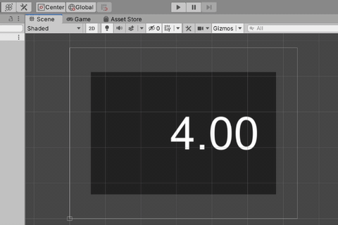

# test65_stop_unity_editor_playing
see also...

  - [EditorApplication-isPlaying - Unity スクリプトリファレンス](https://docs.unity3d.com/ja/2019.4/ScriptReference/EditorApplication-isPlaying.html)

```
  void Update()
  {
      float t = duration - Time.time;
      if (t <= 0.0f) t = 0.0f;
      text.text = $"{t:F2}";

      if (t == 0.0f)
      {
          // Unityエディタでのプレビュー再生を停止する
          UnityEditor.EditorApplication.isPlaying = false;
      }
  }
```



