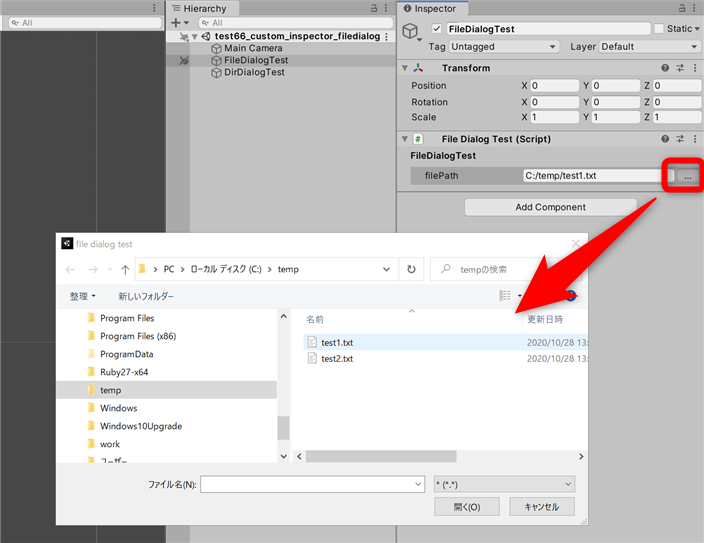

# test66_custom_inspector_filedialog



## code
```
using UnityEngine;

#if UNITY_EDITOR
using UnityEditor;
#endif

public class FileDialogTest : MonoBehaviour
{
    public string filePath;

#if UNITY_EDITOR
    [CustomEditor(typeof(FileDialogTest))]
    public class FileDialogTestInspector : Editor
    {
        public override void OnInspectorGUI()
        {
            var parent = target as FileDialogTest;

            GUIStyle bold_style = new GUIStyle()
            {
                fontSize = EditorStyles.boldFont.fontSize,
                fontStyle = FontStyle.Bold
            };
            EditorGUILayout.LabelField("FileDialogTest", bold_style);

            EditorGUILayout.BeginVertical(GUI.skin.box);
            {
                EditorGUI.indentLevel++;
                EditorGUILayout.BeginHorizontal();
                EditorGUILayout.TextField("filePath", parent.filePath);
                if (GUILayout.Button("...", GUILayout.Width(30)))
                {
                    // see also... https://docs.unity3d.com/ja/current/ScriptReference/EditorUtility.OpenFilePanel.html
                    string path = EditorUtility.OpenFilePanel("file dialog test", "", "*");

                    if (path.Length > 0)
                    {
                        parent.filePath = path;
                    }
                }
                EditorGUILayout.EndHorizontal();
                EditorGUI.indentLevel--;

            }
            EditorGUILayout.EndVertical();
        }
    }
#endif

}
```

```
using UnityEngine;

#if UNITY_EDITOR
using UnityEditor;
#endif

public class DirDialogTest : MonoBehaviour
{
    public string dirPath;

#if UNITY_EDITOR
    [CustomEditor(typeof(DirDialogTest))]
    public class DirDialogTestInspector : Editor
    {
        public override void OnInspectorGUI()
        {
            var parent = target as DirDialogTest;

            GUIStyle bold_style = new GUIStyle()
            {
                fontSize = EditorStyles.boldFont.fontSize,
                fontStyle = FontStyle.Bold
            };
            EditorGUILayout.LabelField("DirDialogTest", bold_style);

            EditorGUILayout.BeginVertical(GUI.skin.box);
            {
                EditorGUI.indentLevel++;
                EditorGUILayout.BeginHorizontal();
                EditorGUILayout.TextField("dirPath", parent.dirPath);
                if (GUILayout.Button("...", GUILayout.Width(30)))
                {
                    // see also... https://docs.unity3d.com/ja/current/ScriptReference/EditorUtility.OpenFolderPanel.html
                    string path = EditorUtility.OpenFolderPanel("dir dialog test", "", "*");

                    if (path.Length > 0)
                    {
                        parent.dirPath = path;
                    }
                }
                EditorGUILayout.EndHorizontal();
                EditorGUI.indentLevel--;

            }
            EditorGUILayout.EndVertical();
        }
    }
#endif
}
```
