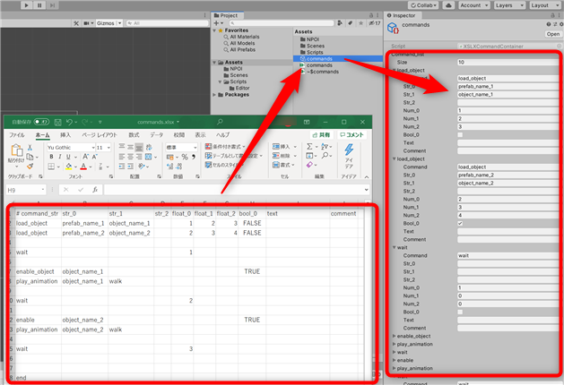

# test67_detect_file_changes



## code
```
// see also... https://docs.unity3d.com/ja/current/ScriptReference/AssetPostprocessor.OnPostprocessAllAssets.html

public class CommandXLSXImporter : AssetPostprocessor
{
    static string target_xlsx_path = "Assets/commands.xlsx";
    static string target_assets_path = "Assets/commands.asset";

    static void OnPostprocessAllAssets(string[] importedAssets, string[] deletedAssets, string[] movedAssets, string[] movedFromAssetPaths)
    {
        foreach (string f in importedAssets)
        {
            if (f == target_xlsx_path)
            {
                ImportXSLX(target_xlsx_path);
            }
        }
    }
    .
    .
    .

```

