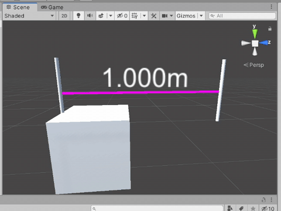
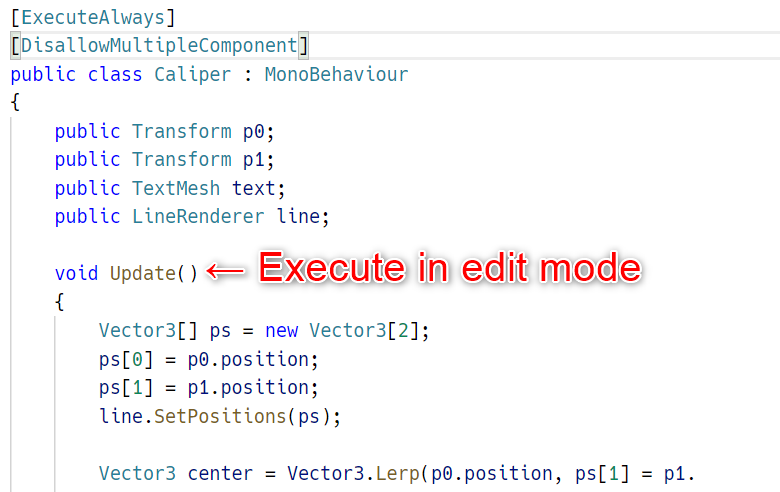
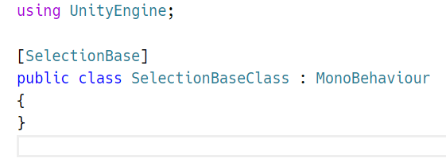
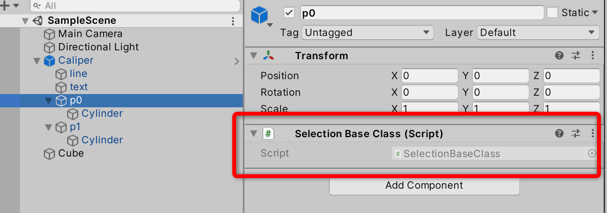

# test70_caliper

# Attributes
## ExecuteAlways
[Unity - Scripting API: ExecuteAlways](https://docs.unity3d.com/ScriptReference/ExecuteAlways.html)

## SelectionBase
[Unity - Scripting API: SelectionBaseAttribute](https://docs.unity3d.com/ScriptReference/SelectionBaseAttribute.html)

