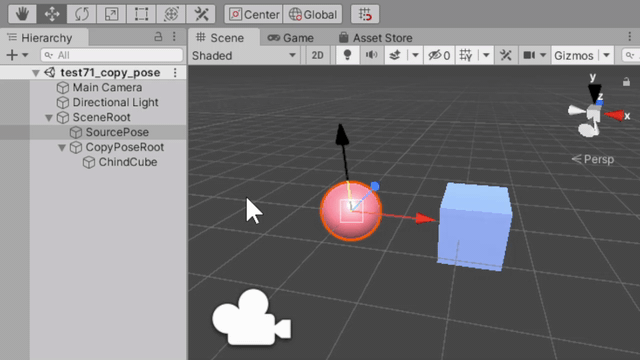

# test71_copy_pose


# code
```
using UnityEngine;

[ExecuteAlways]
public class CopyPose : MonoBehaviour
{
    public Transform sourcePose;
    public bool copyGlobalPose = true;

    void Update()
    {
        if (copyGlobalPose == true)
        {
            this.transform.position = sourcePose.position;
            this.transform.rotation = sourcePose.rotation;
        }
        else
        {
            this.transform.localPosition = sourcePose.localPosition;
            this.transform.localRotation = sourcePose.localRotation;
        }
    }
}
```
