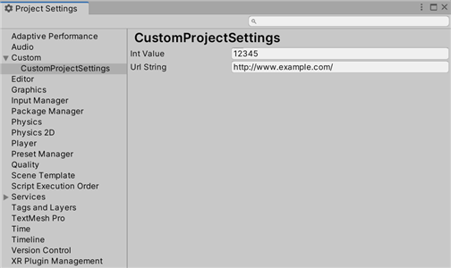

# test74_custom_project_settings



```
using UnityEngine;
using UnityEngine.UIElements;
using UnityEditor;

public class CustomProjectSettings : ScriptableObject
{
    public int intValue;
    public string urlString;

    public static CustomProjectSettings GetInstance()
    {
        var path = "Assets/CustomProjectSettings.asset";
        var settings = AssetDatabase.LoadAssetAtPath<CustomProjectSettings>(path);

        if (settings == null)
        {
            settings = CreateInstance<CustomProjectSettings>();
            AssetDatabase.CreateAsset(settings, path);
            AssetDatabase.SaveAssets();
        }

        return settings;
    }

    public static SerializedObject GetSerializedObject()
    {
        return new SerializedObject(GetInstance());
    }
}

public class CustomProjectSettingsProvider : SettingsProvider
{
    public CustomProjectSettingsProvider(string path, SettingsScope scope) : base(path, scope)
    {
    }

    public override void OnGUI(string searchContext)
    {
        var settings = CustomProjectSettings.GetInstance();

        EditorGUILayout.PropertyField(settings.FindProperty("intValue"));
        EditorGUILayout.PropertyField(settings.FindProperty("urlString"));
        settings.ApplyModifiedProperties();
    }

    [SettingsProvider]
    private static SettingsProvider Create()
    {
        var path = "Project/Custom/CustomProjectSettings";
        var provider = new CustomProjectSettingsProvider(path, SettingsScope.Project);
        var settings = CustomProjectSettings.GetInstance();
        provider.keywords = GetSearchKeywordsFromSerializedObject(settings);

        return provider;
    }
}
```