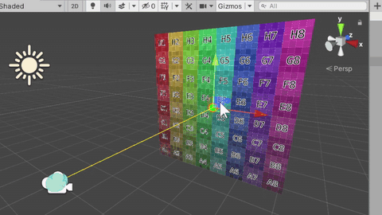

# test78_raycast



```
using UnityEngine;

[ExecuteAlways]
public class RayCastTest : MonoBehaviour
{
    public GameObject objFrom;
    public GameObject objTo;

    public GameObject targetObj;

    void Update()
    {
        if (objFrom == null || objTo == null || targetObj == null) return;

        // for HitTest
        targetObj.layer = 8; 

        var p_from = objFrom.transform.position;
        var p_to = objTo.transform.position;
        var direction = (p_to - p_from).normalized;

        // see also... https://docs.unity3d.com/ja/current/ScriptReference/Physics.Raycast.html
        RaycastHit hit;
        int layerMask = 1 << 8; // layer == 8 

        if (Physics.Raycast(p_from, direction, out hit, Mathf.Infinity, layerMask))
        {
            Debug.DrawRay(p_from, direction * hit.distance, Color.yellow);
            Debug.Log($"point={hit.point}, u={hit.textureCoord.x}, v={hit.textureCoord.y}");
        }
        else
        {
            Debug.DrawRay(p_from, direction * 1000, Color.white);
        }
    }
}
```