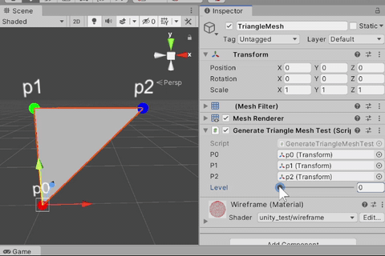

# test81_ generate_triangle_mesh



```
//
//  p1 - p2     p1 - p4 - p2
//  |  /    ->  |  / |  /
//  p0          p3 - p5
//              |  /
//              p0
//
//  p0 - p3 - p5
//  p3 - p1 - p4
//  p5 - p3 - p4
//  p5 - p4 - p2
// 
public List<Triangle> Divide4()
{
    var p0 = GetVertex(idx0);
    var p1 = GetVertex(idx1);
    var p2 = GetVertex(idx2);

    var p3 = (p0 + p1) / 2;
    var p4 = (p1 + p2) / 2;
    var p5 = (p2 + p0) / 2;

    var idx3 = AddVertex(p3);
    var idx4 = AddVertex(p4);
    var idx5 = AddVertex(p5);

    var rv = new List<Triangle>();
    rv.Add(new Triangle(container, idx0, idx3, idx5));
    rv.Add(new Triangle(container, idx3, idx1, idx4));
    rv.Add(new Triangle(container, idx5, idx3, idx4));
    rv.Add(new Triangle(container, idx5, idx4, idx2));

    return rv;
}
```

```
public TriangleMesh(int level, Vector3 p0, Vector3 p1, Vector3 p2)
{
    vetrices.Clear();
    indices.Clear();

    int idx0 = AddVertex(p0);
    int idx1 = AddVertex(p1);
    int idx2 = AddVertex(p2);

    var current = new Queue<Triangle>();
    current.Enqueue(new Triangle(this, idx0, idx1, idx2));

    var next = new Queue<Triangle>();

    for (int i = 0; i < level; ++i) {
        next.Clear();
        while(current.Count > 0) {
            var target_t = current.Dequeue();
            var divide_t4 = target_t.Divide4();
            foreach(var t in divide_t4) {
                next.Enqueue(t);
            }
        }
        current = new Queue<Triangle>(next);
    }

    while(current.Count > 0) {
        var t = current.Dequeue();
        indices.Add(t.idx0);
        indices.Add(t.idx1);
        indices.Add(t.idx2);
    }
}
```


