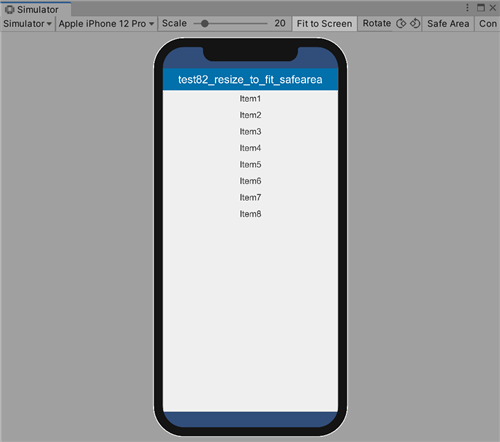
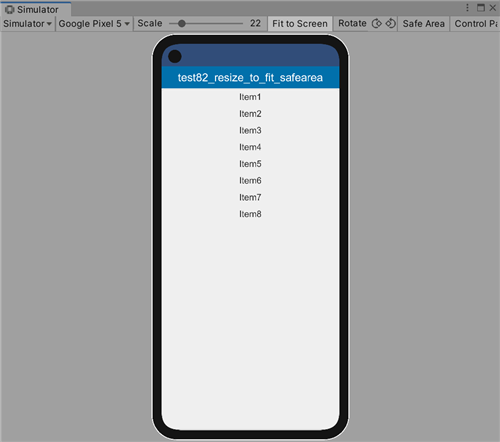

# test82_resize_to_fit_safearea

 

```
//
//  ResizeToFitSafearea.cs
//  
// github:
//     https://github.com/yoggy/unity_test/tree/master/test82_resize_to_fit_safearea
//
// license:
//     Copyright (c) 2022 yoggy <yoggy0@gmail.com>
//     Released under the MIT license
//     https://opensource.org/licenses/MIT
//

using UnityEngine;

public class ResizeToFitSafearea : MonoBehaviour
{
    int lastScreenWidth;
    int lastScreenHeight;

    void Awake()
    {
        lastScreenWidth = Screen.width;
        lastScreenHeight = Screen.height;

        ResizeToFitAreaInner();
    }

    void Update()
    {
        Resolution currenrResolution = Screen.currentResolution;
        if (Screen.width != lastScreenWidth || Screen.height != lastScreenHeight)
        {
            ResizeToFitAreaInner();

            lastScreenWidth = Screen.width;
            lastScreenHeight = Screen.height;
        }
    }

    void ResizeToFitAreaInner()
    {
        var rectTransform = GetComponent<RectTransform>();
        var safeArea = Screen.safeArea;

        var anchorMin = safeArea.position;
        var anchroMax = safeArea.position + safeArea.size;

        rectTransform.anchorMin = new Vector2(anchorMin.x / Screen.width, anchorMin.y / Screen.height);
        rectTransform.anchorMax = new Vector2(anchroMax.x / Screen.width, anchroMax.y / Screen.height);
    }
}
```


