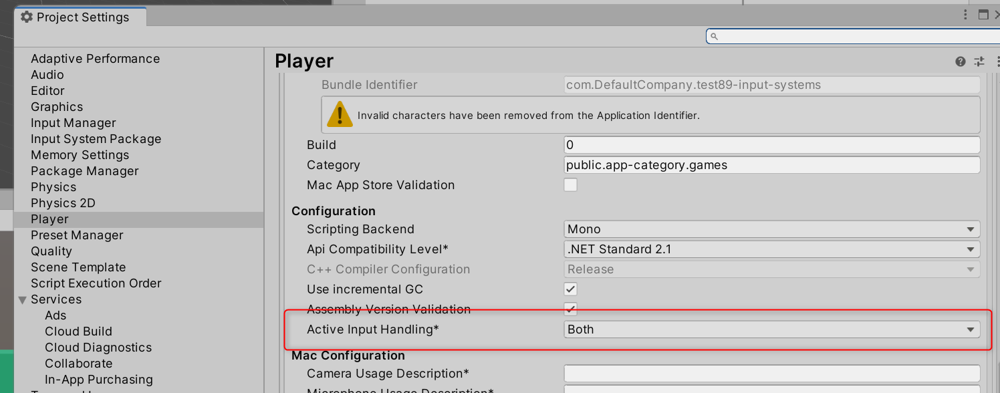
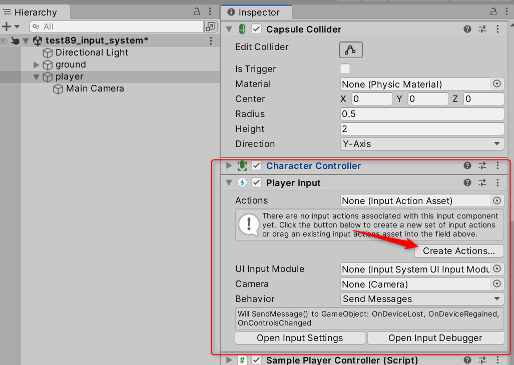
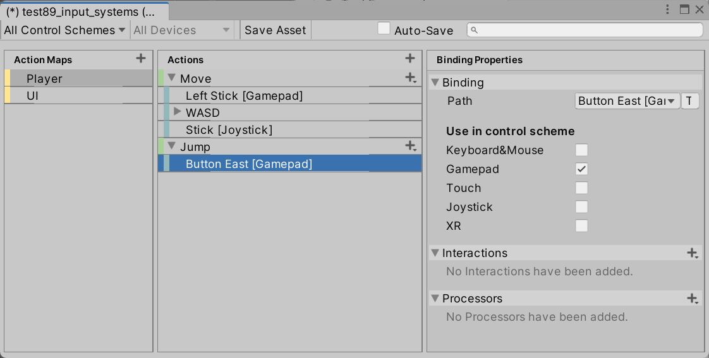
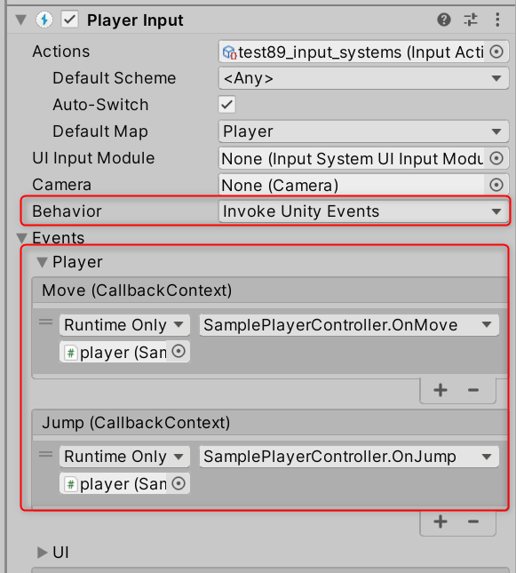

# test89_input_system







```
using UnityEngine;
using UnityEngine.InputSystem;

// see also... https://forpro.unity3d.jp/unity_pro_tips/2021/05/20/1957/
public class SamplePlayerController : MonoBehaviour
{
    public float movingSpeed = 2.0f;

    Vector2 _moveValue;
    float _gravity = -9.8f;
    float _yVelocity = -9.8f;
    CharacterController _characterController;

    void Start()
    {
        _characterController = GetComponent<CharacterController>();
    }

    public void OnMove(InputAction.CallbackContext context)
    {
        _moveValue = context.ReadValue<Vector2>();
    }

    public void OnJump(InputAction.CallbackContext context)
    {
        Debug.Log($"OnJump() val={context}");

        if (context.phase == InputActionPhase.Started && _characterController.isGrounded == true)
        {
            _yVelocity = 7.0f;
        }
    }

    void Update()
    {
        Vector3 diff = new Vector3(_moveValue.x, 0.0f, _moveValue.y) * movingSpeed * Time.deltaTime;

        if (_yVelocity + _gravity * Time.deltaTime > _gravity)
        {
            _yVelocity = _yVelocity + _gravity * Time.deltaTime;
        }
        else
        {
            _yVelocity = _gravity;
        }
        diff.y = _yVelocity * Time.deltaTime;

        _characterController.Move(diff);
    }
}
```