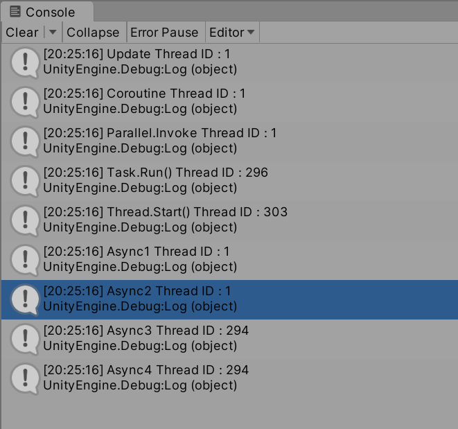

# test91_unity_coroutine

```
using System.Collections;
using System.Threading;
using System.Threading.Tasks;
using UnityEngine;

public class ThreadIDIndicator : MonoBehaviour
{
    void Start()
    {
        // main thread
        Debug.Log($"Update Thread ID : {Thread.CurrentThread.ManagedThreadId}");

        StartCoroutine("TestCoroutine");

        Parallel.Invoke(() => { Debug.Log($"Parallel.Invoke Thread ID : {Thread.CurrentThread.ManagedThreadId}"); });

        Thread t = new Thread(ThreadWork);
        t.IsBackground = true;
        t.Start();

        Task.Run(() => Debug.Log($"Task.Run() Thread ID : {Thread.CurrentThread.ManagedThreadId}"));

        Async1();
    }

    IEnumerator TestCoroutine()
    {
        Debug.Log($"Coroutine Thread ID : {Thread.CurrentThread.ManagedThreadId}");
        yield break;
    }

    public void ThreadWork()
    {
        Debug.Log($"Thread.Start() Thread ID : {Thread.CurrentThread.ManagedThreadId}");
    }

    async void Async1()
    {
        Debug.Log($"Async1 Thread ID : {Thread.CurrentThread.ManagedThreadId}");
        await Async2().ContinueWith(_ => Async3()).ContinueWith(_ => Async4());
    }

    async Task Async2()
    {
        Debug.Log($"Async2 Thread ID : {Thread.CurrentThread.ManagedThreadId}");
        await Task.Delay(0);
    }

    async Task Async3()
    {
        Debug.Log($"Async3 Thread ID : {Thread.CurrentThread.ManagedThreadId}");
        await Task.Delay(0);
    }

    async Task Async4()
    {
        Debug.Log($"Async4 Thread ID : {Thread.CurrentThread.ManagedThreadId}");
        await Task.Delay(0);
    }
}
```

### result

 - 